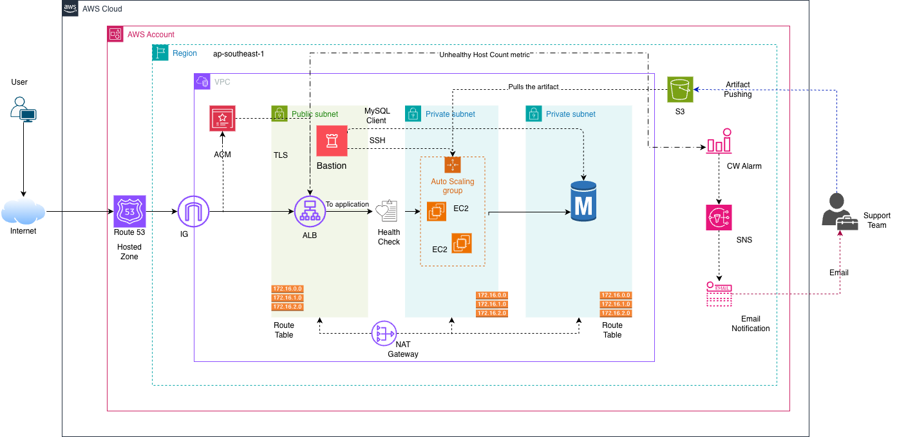

# System Architecture

This document outlines the AWS deployment architecture for the Java Spring PetClinic 3-tier application.

## 📊 Architecture Diagram

## 🧩 Components

- **Public Subnet**
  - Bastion Host for secure SSH access
  - Application Load Balancer (ALB) for routing traffic
  - Health checks for instance monitoring

- **Private Subnet**
  - Auto Scaling Group managing EC2 instances
  - EC2 instances running the Spring Boot app
  - Artifact repository for deployment packages

- **Networking**
  - VPC with CIDR blocks: `10.10.0.0/16`
  - Route 53 for DNS resolution
  - Internet Gateway and NAT configuration

- **Monitoring**
  - CloudWatch metrics for unhealthy hosts
  - Centralized logging and analytics pipeline

## 🔁 Data Flow

1. User accesses the app via Route 53 DNS.
2. Traffic hits the ALB in the public subnet.
3. ALB routes requests to EC2 instances in the private subnet.
4. EC2 instances fetch artifacts and serve responses.
5. Monitoring tools track health and performance.

## 🚀 Deployment Notes

- Infrastructure provisioned via Terraform modules.
- Secrets managed via local .tfvars file.

## 📌 Future Enhancements

- Add Redis caching layer
- Integrate centralized logging (ELK or CloudWatch Logs)
- Enable autoscaling policies based on CPU/memory thresholds
